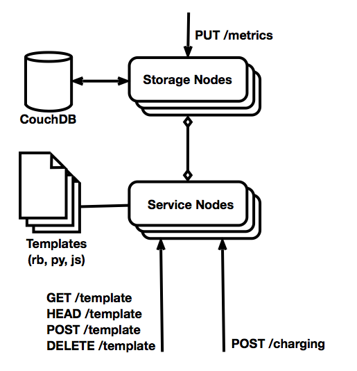
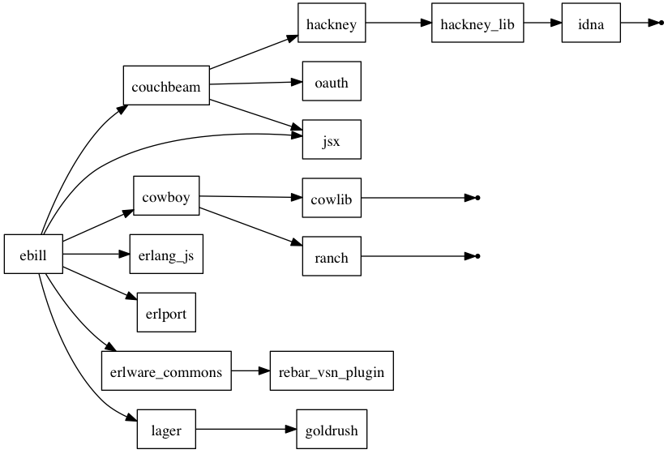

# eBill

A cloud-oriented rating server

## Architecture



## Installation

### Requirements

* [erlang](http://www.erlang.org)
* [couchdb](http://couchdb.apache.org).

> **Why CouchDB ?**
>
> Because the mongodb erlang driver is... not... hum...



### Configuration

#### .hosts.erlang

On the server, create a `.hosts.erlang` in the current directory, or in your
home directory. The format of the `.hosts.erlang` file must be one host name
per line. The host names must be within quotes as shown in the following
example:

    'storage1.example.com'.
    'storage2.example.com'.
    'storage3.example.com'.
    ^ (new line)

If you plan to start a storage node on the same host as the server, don't
forget to add this host in the list.

#### ebill.conf

The `ebill.conf` file allow you to configure the server and storage nodes.
Thus, you can create a `ebill.conf` file on the server and every storage node.

This file can be placed in `/etc/`, `/Library/Application Support/ebill/`,
`~/Library/Application Support/ebill/`, `~/.ebill` and `.`. If many files
exist, eBill will read then in this order and update the configuration
consequently.

You can add comments in a configuration file. A comment start with a `#`.

A configuration accept the following parameters :

On the server :

* `tcp_server_port` : port used by the server (default : `8080`)
* `max_server_conn` : maximum connections accepted by the server (default : `100`)

On the storage nodes:

* `tcp_storage_port` : port used by the storage (default : `8090`)
* `max_storage_conn` : maximum connections accepted by the storage (default : `100`)
* `db_storage_host` : the couchdb hostname (default : `localhost`)
* `db_storage_port` : the couchdb port (default : `5984`)
* `db_storage_name` : the couchdb database name (default : `ebill`)

On booth server and storage nodes :

* `cookie` : erlang cookie. **MUST BE IDENTICAL ON ALL NODES !!!**

## Start 

**server** :

    ./ebill --app server start

**storage**

    ./ebill --app storage start

See `ebill -h` for more options.

## Interfaces

To access the eBill interface, open `http://<server>:<tcp_server_port>/` in your browser.

To access the couchdb interface, open `http://<storage>:<tcp_storage_port>/` in your browser. You can also use the _Database_ menu in the eBill interface.

## APIs

### Storage/Metric

`PUT /metrics`
:  Add metrics in the database

Fields `project_id`, `resource_id` and `metrics` are required. If no date (field `date`) is given, the current date will be used.

Data example :

```json
{
  "project_id": "EA08CC13-1C54-4044-BB67-B0529CF2E634",
  "resource_id": "FB45D8CF-0FFA-4C15-9A60-4256D997EFF9",
  "metrics": {
    "cpu.usage": 80,
    "mem.usage": 1024
  },
  "date": "2014-01-13T14:22:27.0",
  "metadatas": {
    "iaas.name": "Amazon EC2",
    "iaas.tenant.name": "eNovance",
    "iaas.user.name": "glejeune"
  }
}
```

Example :

```bash
curl -i -X PUT -H "Content-Type: application/json" http://localhost:8090/metrics -d "{ \
  \"project_id\": \"EA08CC13-1C54-4044-BB67-B0529CF2E634\", \
  \"resource_id\": \"FB45D8CF-0FFA-4C15-9A60-4256D997EFF9\", \
  \"metrics\": { \
    \"cpu.usage\": 80, \
    \"mem.usage\": 1024 \
  }, \
  \"date\": \"2014-01-13T14:22:27.0\", \
  \"metadatas\": { \
    \"iaas.name\": \"Amazon EC2\", \
    \"iaas.tenant.name\": \"eNovance\", \
    \"iaas.user.name\": \"glejeune\" \
  } \
}"
```

    < HTTP/1.1 204 No Content
    < connection: keep-alive
    < server: Cowboy
    < date: Mon, 13 Jan 2014 14:16:10 GMT
    < content-length: 0
    < content-type: text/html
    < vary: accept

### Server/Billing

`POST /charging`
:  Get the billing informations

Only fields `project_id` and `template` are required.

Allowed filters operators : `==`, `!=`, `<=`, `>=`, `<`, `>`, `=~` (assume that the value is a regex), `in` (assume that the value is a list).

Data example :

```json
{
  "project_id": "EA08CC13-1C54-4044-BB67-B0529CF2E634",
  "resource_id": "FB45D8CF-0FFA-4C15-9A60-4256D997EFF9",
  "metrics": ["cpu.usage", "mem.usage"],
  "period": {
    "start_date": "2013-01-06",
    "end_date": "2013-30-06"
  },
  "filters": [
    {"iaas.name", "=~", "[a|A]mazon.*"},
    {"iaas.tenant.name", "==", "eNovance"}
  ],
  "template": "christmas_billing"
}
```

Example :

```bash
curl -i -X POST -H "Content-Type: application/json" http://localhost:8080/charging -d "{ \
  \"project_id\": \"EA08CC13-1C54-4044-BB67-B0529CF2E634\", \
  \"period\": { \
    \"start_date\": \"2013-01-06\", \
    \"end_date\": \"2013-30-06\" \
  }, \
  \"filters\": [ \
    {\"iaas.name\", \"=~\", \"[a|A]mazon.*\"}, \
    {\"iaas.tenant.name\", \"==\", \"eNovance\"} \
  ], \
  \"template\": \"christmas_billing\" \
}"
```

`POST /cost`
:  Get cost

Data example :

```json
{
  "resource_ids": ["lb", "app", "db"],
    "groups": {
      "lb": {"min": 1, "max": 2},
      "app": {"min": 2,"max": 10},
      "db": {"min": 1,"max": 1}
    },
    "metrics": {
      "unit": "second",
      "monitor": {
        "lb": {"cpu.usage": 20},
        "app": {"cpu.usage": 20},
        "db": {"cpu.usage": 20}
      }
    },
    "template": "openstack_deployment_cost",
    "period": {"unit": "day", "duration": 30}
}
```

Example :

```bash
curl -i -X POST -H "Content-Type: application/json" http://localhost:8080/cost -d "{ \
  \"resource_ids\": [\"lb\", \"app\", \"db\"], \
  \"groups\": { \
    \"lb\": {\"min\": 1, \"max\": 2, \"flavor\": \"m1.micro\", \"os\": \"unix\"}, \
    \"app\": {\"min\": 2,\"max\": 10, \"flavor\": \"m3.medium\"}, \
    \"db\": {\"min\": 1,\"max\": 1, \"os\": \"rhel\"} \
  }, \
  \"metrics\": { \
    \"unit\": \"s\", \
    \"monitor\": { \
      \"lb\": {\"cpu.usage\": 20, \"network.incoming.bytes\": 10}, \
      \"app\": {\"cpu.usage\": 20}, \
      \"db\": {\"cpu.usage\": 20} \
    } \
  }, \
  \"template\": \"openstack_deployment_cost\", \
  \"period\": {\"unit\": \"d\", \"duration\": 30} \
}"
```

### Server/Templates

`GET /template/:id`
:  Retrieve the template with ID `:id`

        curl -i -X GET http://localhost:8080/template/test
        > HTTP/1.1 200 OK
        > connection: keep-alive
        > server: Cowboy
        > date: Mon, 16 Dec 2013 15:56:50 GMT
        > content-length: 26
        > content-type: application/json
        >
        > {"template":"test"}

`HEAD /template/:id`
:  Retrieve the template with ID `:id`

        curl -i -X HEAD http://localhost:8080/template/test
        > HTTP/1.1 200 OK
        > connection: keep-alive
        > server: Cowboy
        > date: Mon, 16 Dec 2013 15:56:57 GMT
        > content-length: 0
        > content-type: application/json

`GET /template`
:  Return the list of all availables templates

        curl -i -X GET http://localhost:8080/template
        > HTTP/1.1 200 OK
        > connection: keep-alive
        > server: Cowboy
        > date: Mon, 16 Dec 2013 15:56:40 GMT
        > content-length: 66
        > content-type: application/json
        >
        > {"ruby":["test_ruby"],"python":["test_python"],"lua":["test_lua"]}

`DELETE /template/:id`
:  Remove the template with ID `:id`

        curl -i -X DELETE http://localhost:8080/template/test
        > HTTP/1.1 204 No Content
        > connection: keep-alive
        > server: Cowboy
        > date: Mon, 16 Dec 2013 15:56:15 GMT
        > content-length: 0
        > content-type: application/json

`POST /template`
:  Add a template

        curl -i -F template=@test.rb -X POST http://localhost:8080/template
        > HTTP/1.1 100 Continue
        >
        > HTTP/1.1 200 OK
        > connection: keep-alive
        > server: Cowboy
        > date: Mon, 16 Dec 2013 16:00:24 GMT
        > content-length: 19
        > content-type: application/json
        >
        > {"template":"info"}

## Templates

Templates are Ruby, Python, Javascript <span style="text-decoration: line-through">or Lua</span>(WIP) scripts.

Example :

**Ruby:**

```ruby
require 'ebill'

def rate(data)
  EBill.info("Data receive : #{data.inspect}")

  json = EBill.to_json(data)

  # do something with data ...

  EBill.ok({:total => amount, :currency => "USD"})
end
```

**Python:**

```python
import ebill


def rate(data):
    ebill.info("Data receive : {0}".format(data))

    json = ebill.to_json(data)

    # do something with data ...

    ebill.ok({"total": amount, "currency": "USD"})
```

**Javascript:**

```javascript
function rate(data) {
  ebill.info("eBill version " + ebill.VERSION);
  ebill.info("Data : " + data.inspect);

  json = ebill.to_json(data);
  ebill.info("JSON : " + json);

  rc = ebill.ok({"total": 1023, "detail": ["some", "data"]});
  ebill.info("result : " + rc);
  return rc;
}
```

### Ruby helpers

`EBill.info(x)`
: log message `x` with level info

`EBill.error(x)`
: log message `x` with level error

`EBill.warning(x)`
: log message `x` with level warning

`EBill.to_json(x)`
: Parse the JSON string `x` to a Ruby data structure

`EBill.ok(x)`
: Generate a return message from a valide Ruby data structure

`EBill.err(x)`
: Generate a return message from an error

### Python helpers

`ebill.info(x)`
: log message `x` with level info

`ebill.error(x)`
: log message `x` with level error

`ebill.warning(x)`
: log message `x` with level warning

`ebill.to_json(x)`
: Parse the JSON string `x` to a Ruby data structure

`ebill.ok(x)`
: Generate a return message from a valide Ruby data structure

`ebill.err(x)`
: Generate a return message from an error

### Javascript helpers

`ebill.info(x)`
: log message `x` with level info (TODO)

`ebill.error(x)`
: log message `x` with level error (TODO)

`ebill.warning(x)`
: log message `x` with level warning (TODO)

`ebill.to_json(x)`
: Parse the JSON string `x` to a Ruby data structure

`ebill.ok(x)`
: Generate a return message from a valide Ruby data structure

`ebill.err(x)`
: Generate a return message from an error

## Authors

* Grégoire Lejeune <gregoire.lejeune@enovance.com>

## Copyright

Copyright (c) 2013, 2014 eNovance.  All rights reserved.
